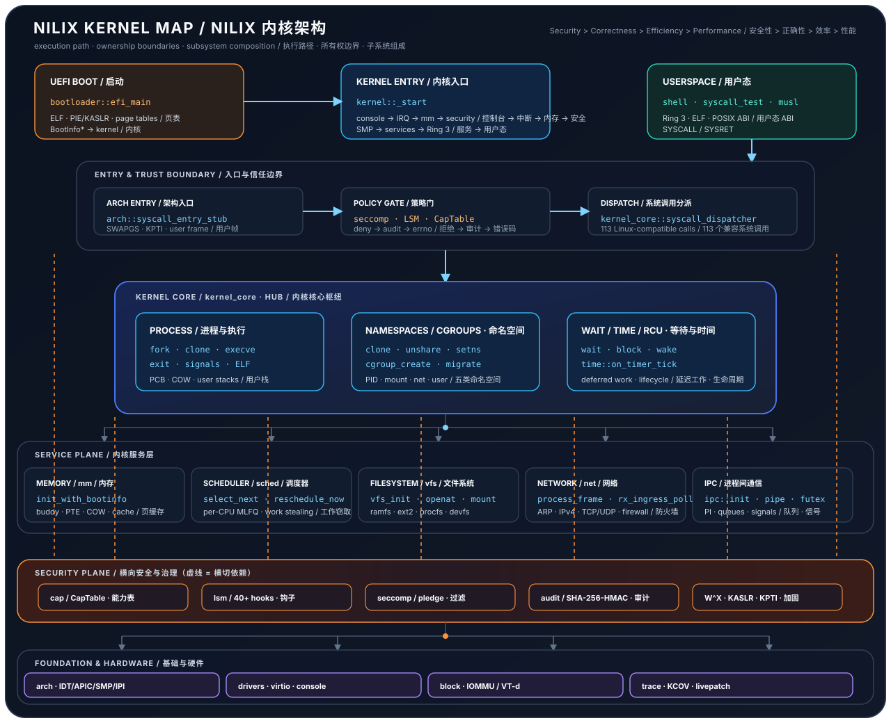

# Nilix

[Chinese(切换到中文)](README_zh.md)

A security-first hybrid microkernel operating system written in Rust for the x86_64 architecture.

> **Nilix** is a recursive acronym — **N**ilix **I**s **L**inux **I**ndependent e**X**istence — in the
> self-referential naming tradition of GNU and Linux. The name captures the positioning: Linux-*compatible*
> (a byte-exact syscall ABI runs a real musl libc binary unmodified) yet Linux-*independent* (its own
> from-scratch Rust kernel, not a fork).

**Design Principle:** Security > Correctness > Efficiency > Performance

---

## What is Nilix

Nilix is an enterprise-grade hybrid kernel inspired by Linux's modular design, hardened
through **187 successive R-series security-audit rounds** plus a 2026-08-07 standalone
full-codebase audit (remediated 2026-08-27). It pairs a capability- and LSM-gated in-kernel
hot path with a roadmap toward a de-privileged Linux-compatible user-space personality.

## Highlights

- **Memory Safety** — written entirely in Rust (`no_std`), backed by hardware protections
  (NX, W^X, SMEP/SMAP/UMIP) and KASLR/KPTI.
- **Process Isolation** — per-process address spaces, Copy-on-Write fork, user-stack guard pages.
- **SMP** — multi-core bring-up (up to 64 CPUs), per-CPU MLFQ scheduling, work-stealing load
  balancing, IPI-driven TLB shootdown, RCU and lockdep.
- **Security Framework** — object capabilities, an LSM hook layer (40+ hook points),
  seccomp/pledge syscall filtering, and a SHA-256/HMAC hash-chained tamper-evident audit log.
- **Containers** — five namespaces (PID/mount/IPC/net/user) and cgroups v2 (CPU, memory,
  PIDs, I/O, FD, port controllers), plus a per-namespace network dataplane (isolated ARP
  caches, addressing, and routing) held under per-namespace byte budgets.
- **Network** — a full software TCP/IP stack (TCP with NewReno, window scaling, SYN cookies,
  connection tracking, and a stateful default-DROP firewall), fed by a bounded
  process-context RX ingress loop that ingests real frames off `eth0`.
- **Linux ABI** — a byte-exact x86-64 syscall surface; a real **static-musl libc binary runs
  end-to-end** under the user-mode ABI (Phase U / milestone M0).

## Architecture at a glance

Nilix is organized around one narrow execution path:

`Ring 3 → architecture entry → policy gate → kernel_core → service plane → hardware`

solid arrows show the main call/data flow, dashed lines show cross-cutting security and observability.

<p align="center">
  
</p>

### Read the hot paths

| Path | Main functions | What happens |
|------|----------------|--------------|
| Boot & handoff | [`bootloader::efi_main`](bootloader/src/main.rs#L607) → [`kernel::_start`](kernel/src/main.rs#L321) | Load the PIE kernel, establish paging/KASLR, publish `BootInfo*`, then initialize the kernel in dependency order. |
| Syscall ABI | [`arch::syscall_entry_stub`](kernel/arch/syscall.rs#L1036) → [`kernel_core::syscall_dispatcher`](kernel/kernel_core/syscall.rs#L3682) → `sys_*` | Enter through `SYSCALL`, apply seccomp/LSM/capability gates, dispatch the Linux-compatible number, and return through `SYSRET`. |
| Process & memory | [`fork::sys_fork`](kernel/kernel_core/fork.rs#L155), [`fork::handle_cow_page_fault`](kernel/kernel_core/fork.rs#L1186), [`mm::memory::init_with_bootinfo`](kernel/mm/memory.rs#L421) | Create an isolated address space, share COW frames, charge resources, and resolve faults without publishing partial state. |
| IRQ & scheduling | [`sched::enhanced_scheduler::on_clock_tick`](kernel/sched/enhanced_scheduler.rs#L2107) → [`reschedule_now`](kernel/sched/enhanced_scheduler.rs#L2565) → [`arch::context_switch::switch_context`](kernel/arch/context_switch.rs#L235) | A timer/IPI event updates the per-CPU MLFQ, selects a runnable task, and switches context with affinity and security hooks. |
| Network RX | [`net::process_frame`](kernel/net/src/stack.rs#L452) → [`rx_ingress_poll`](kernel/net/src/stack.rs#L3583) | Poll bounded device work in process context, parse Ethernet/IP/TCP/UDP, apply conntrack/firewall policy, and wake sockets. |
| Storage & mounts | [`vfs::vfs_init`](kernel/vfs/lib.rs#L118) → [`block::probe_devices`](kernel/block/src/lib.rs#L1238) → [`iommu::init`](kernel/iommu/lib.rs#L401) | Bring up filesystem roots and block devices, then mount the discovered storage through the BIO/virtio path. |

<details>
<summary>Key entry points by subsystem</summary>

| Area | Main symbols | Responsibility |
|------|--------------|----------------|
| Entry | `bootloader::efi_main`, `kernel::_start`, `arch::syscall_entry_stub` | UEFI handoff, kernel bring-up, register-safe Ring-3 entry/exit. |
| Core | `kernel_core::syscall_dispatcher`, `sys_fork`, `sys_clone`, `sys_execve`, `sys_exit` | Dispatch, process lifecycle, ELF replacement, signals, namespaces, and cgroups. |
| Memory | `mm::memory::init_with_bootinfo`, `PageTableManager::{map_range, unmap_range}`, `handle_cow_page_fault` | Admission-accounted heap/buddy allocation, page-table publication, COW and reclaim. |
| Scheduler | `enhanced_scheduler::{init, select_next, on_clock_tick, reschedule_now}` | Per-CPU MLFQ, preemption, work stealing, affinity/cpuset, and context switching. |
| VFS & block | `vfs::vfs_init`, `FileDescriptor::{read, write}`, `block::{init, probe_devices}` | Filesystem operations, page-cache-backed I/O, BIO queues, and virtio-blk discovery. |
| Network | `net::{process_frame, rx_ingress_poll}`, `tcp::{handle_ack, handle_retransmission_timeout}` | Bounded RX, protocol state machines, retransmission, conntrack, and firewall decisions. |
| IPC | `ipc::{init, pipe_create_callback, futex_callback}` | Capability-bearing pipes, futex wait/wake with PI, and signal-interruptible blocking. |
| Security | `security::init`, `lsm::{hook_syscall_enter, hook_syscall_exit}`, `seccomp::evaluate_current`, `audit::{emit, export}` | Enforce W^X/KPTI and policy gates, then record security decisions in the hash chain. |
| Platform | `arch::{interrupts::init, apic::init, smp::start_aps}`, `iommu::init`, `trace::init` | Interrupts, SMP/IPI, DMA isolation, watchdogs, tracing, and KCOV integration. |

</details>

| Subsystem | Status | Highlights |
|-----------|--------|-----------|
| Boot & Memory | ✅ Complete | UEFI static-PIE boot, high-half map, reservation-aware buddy allocator, page cache, COW fork, guard pages, OOM killer |
| Process & Threads | ✅ Complete | Per-process address spaces, fork/exec/clone, threads + TLS, wait/zombie reaping, hung-task watchdog |
| Scheduler | ✅ Complete | Per-CPU MLFQ, preemptive, work-stealing + periodic load balancing, CPU affinity / cpuset |
| IPC | ✅ Complete | Pipes, capability message queues, futex (+ priority inheritance), POSIX signals |
| Hardening | ✅ Complete | W^X/NX, SMEP/SMAP/UMIP, KASLR, KPTI, Spectre/Meltdown mitigations, ChaCha20 CSPRNG, kptr guard |
| Security Framework | ✅ Complete | Capabilities, LSM (40+ hooks), seccomp/pledge, SHA-256/HMAC hash-chained audit, compliance profiles |
| VFS & Storage | ✅ Complete | ramfs, ext2, procfs, devfs, initramfs (CPIO), cgroupfs, DAC + openat2 RESOLVE flags, virtio-blk |
| Network | ✅ Complete | virtio-net, ARP, IPv4 (+reassembly), ICMP, UDP, TCP, conntrack, stateful firewall, bounded RX ingress loop with live `eth0` receive |
| SMP & Concurrency | ✅ Complete | LAPIC/IOAPIC, AP boot (≤64 CPUs), IPI TLB shootdown, PCID/INVPCID, RCU, lockdep |
| Containers | ✅ Complete | PID/mount/IPC/net/user namespaces, cgroups v2 (6 controllers), per-namespace network dataplane (ARP/addressing/routing under per-NS byte budgets) |
| IOMMU / VT-d | 🟡 Infrastructure | Full Intel VT-d driver (DMA isolation, IRQ remapping, fault handling); DMAR discovery wiring pending |
| Live Patching | 🟡 Infrastructure | ECDSA P-256 signed kpatch, INT3 detour, fail-closed LSM gate |
| User Mode & ABI (Phase U / M0) | 🟡 In Progress | Ring 3, 100+ Linux syscalls, SysV auxv, signal delivery, static-musl libc runs end-to-end |
| Fuzzing & Testing | ✅ Complete | Syzkaller-style coverage-guided fuzzing operational + cargo-fuzz QEMU integration (13 targets), KCOV per-task coverage, deterministic guest E2E, extended stability/SMP/security suites |
| CI & Quality Gates | ✅ Complete | GitHub Actions (fmt/clippy, build, lint, boot+musl+fuzz), custom lint gates, local-first pre-push hook with optional SSH offload |

For the crate layout, the verified layering & dependency DAG, the boot flow, the syscall
path, and the full component narrative see **[docs/architecture.md](docs/architecture.md)**.

## Status

**Milestone:** approaching **1.0-Preview** — Phase A–G complete; **Phase U** (user-mode ABI)
in progress. The 1.0-Preview release gate remains **BLOCKED** on the carried `R186-4` HIGH
(VMA/MM aggregate admission); the zero-HIGH streak is **0/3**. R187 (KCOV remediation, 2026-08-08)
closed clean — 7 findings fixed and 8/8 review-fix defects repaired — but did not advance the
streak (carried debt, not an R187 finding). A 2026-08-07 standalone full-codebase audit (R188)
was remediated 2026-08-27 — all 3 HIGH and 24 MEDIUM findings fixed, residuals
`U37-1`/`U55-6`/`U29-3` explicitly open — but as a standalone audit it is not an R-series
round and does not advance the streak. Full detail: **[security audit status](docs/security-audit-status.md)**
and **[CHANGELOG](CHANGELOG.md)**.

## Quick start

### Prerequisites

- Rust **nightly** with `rust-src` and `llvm-tools-preview` (pinned in `rust-toolchain.toml`;
  targets `x86_64-unknown-none` and `x86_64-unknown-none-uefi`)
- QEMU (`qemu-system-x86_64`) with OVMF firmware for UEFI boot
- GNU Make
- `musl-tools` (`musl-gcc`) — only for the musl conformance gate

### Common commands

```bash
make build           # Build bootloader + kernel into the EFI System Partition (esp/)
make run             # Run in QEMU (graphical VGA window)
make run-serial      # Run with serial console on the terminal
make run-shell       # Build + run the interactive shell (serial)
make run-blk         # Attach a 64 MB ext2 virtio-blk disk
make run-smp         # Multi-core boot (SMP_CPUS=N, default 2)
make debug           # Start QEMU paused for GDB on :1234
make clean           # Remove build artifacts
```

QEMU launches with a CPU model that exposes `+smep,+smap,+umip,+rdrand`, so SMEP/SMAP/UMIP
and hardware RNG are exercised by default. Run `make help` for the full target list. CI,
boot/conformance gates, custom lints, and the fuzzing infrastructure are documented in
**[docs/quality-gates.md](docs/quality-gates.md)**.

## Documentation

| Goal | Document |
|------|----------|
| Overview & navigation | [docs/README.md](docs/README.md) — the documentation index |
| Architecture (layout, DAG, boot, syscall, components) | [docs/architecture.md](docs/architecture.md) · deep: [docs/overview/architecture/ARCHITECTURE.md](docs/overview/architecture/ARCHITECTURE.md) |
| CI, test & fuzzing gates | [docs/quality-gates.md](docs/quality-gates.md) · [docs/fuzzing/](docs/fuzzing/) · [docs/testing/](docs/testing/) |
| Security audit status | [docs/security-audit-status.md](docs/security-audit-status.md) · [docs/security/](docs/security/) · [docs/review/audits/](docs/review/audits/) |
| Recent changes | [CHANGELOG.md](CHANGELOG.md) |
| Roadmap | [docs/roadmap.md](docs/roadmap.md) · [docs/roadmap-enterprise.md](docs/roadmap-enterprise.md) |
| Review process | [docs/review/](docs/review/) (audits, review-fix, next-phase plan) |

## Contributing

Community and maintenance entry points:

- **[CONTRIBUTING.md](CONTRIBUTING.md)** — toolchain, kernel invariants, risk-selected tests,
  RFCs, commits, pull requests, and review.
- **[SUPPORT.md](SUPPORT.md)** — where and how to file bugs, proposals, performance reports,
  documentation issues, and questions.
- **[SECURITY.md](SECURITY.md)** — private vulnerability reporting, threat scope, evidence,
  and coordinated disclosure.
- **[GOVERNANCE.md](GOVERNANCE.md)** — roles, decisions, review/merge policy, issue lifecycle,
  and release gates.
- **[CODE_OF_CONDUCT.md](CODE_OF_CONDUCT.md)** — expected behavior in project spaces.

In short: contributors with a local Rust toolchain build, lint, and test locally — exactly
what CI does. Run the core gates plus the checks selected by risk (ABI, SMP/concurrency, storage, fuzzing, performance,hardware), 
open an RFC before architecture/trust-boundary/ABI/dependency/cross-subsystem work,
and include regression tests with bug and security fixes. 

## License

License terms are currently TBD.

## References

- [OSDev Wiki](https://wiki.osdev.org)
- [Writing an OS in Rust](https://os.phil-opp.com)
- [Linux Kernel Source](https://kernel.org)
- [seL4 Microkernel](https://sel4.systems)
